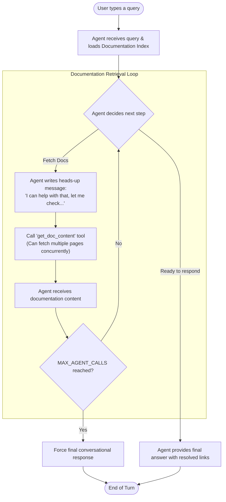

# MONEI AI Documentation Agent

An AI Documentation Agent built with TypeScript and the Amazon Bedrock Converse API. This CLI conversational agent acts as an integration assistant for MONEI developers, utilizing tool use to dynamically retrieve, navigate, and process live MONEI documentation.

## Demo

<video src="https://github.com/eyengabompongo8/AI-Agent-for-enterprise-documentation/blob/main/AI-Docs-Agent.mp4?raw=true" controls="controls" style="max-width: 100%;">
</video>


## Features

* **Dynamic Tool Use & Navigation**: Actively navigates the official MONEI documentation index (`llms.txt`) and fetches live markdown pages to answer deeply nested integration queries.
* **Intelligent Looping Protection (`MAX_AGENT_CALLS`)**: Instructs the model to organically fall back to a conversational response if it exhausts maximum tool-use steps, preventing infinite loops and saving inference costs.
* **Rolling Context Window (`MAX_HISTORY_MESSAGES`)**: Prunes older interactions on the fly to respect hard token limits, guaranteeing reliable long-session execution while preserving exact contextual boundaries for AWS Bedrock requirements.
* **Performance Optimizations (In-Memory Caching)**: Re-fetches of the same documentation are served instantly from an active session Map, avoiding redundant HTTP roundtrips.
* **Robust Domain Whitelisting**: Integrates strict domain verification (SSRF Protection), preventing prompt injection exploits that attempt to push the agent to act as a general-purpose web scraper.
* **Rich Observability Engine**: Using the `-o` flag streams the entirely raw interaction footprint (including transparent mapping of abstract references to real URLs) directly into `traces/` for auditing and metrics.

## How it Works

The agent follows an iterative process to ensure accurate answers by navigating the documentation index and fetching relevant pages before responding.





## Prerequisites

* **Node.js**: v18+ (Requires global `fetch` API)
* **AWS Account**: Configured to call the LLM.

## Project Setup

1. **Install dependencies**:
   ```bash
   npm install
   ```

2. **Configure Environment Variables**:
   Copy `.env.example` to a `.env` file at the root of the project and fill in the following keys:

   ```env
   # AWS Authentication (If not using ~/.aws/credentials profile)
   AWS_BEARER_TOKEN_BEDROCK=your_aws_bearer_token

   # Model Selection
   LLM_MODEL_ID="eu.anthropic.claude-3-5-sonnet-20240620-v1:0" # Change based on your active AWS model

   # Agent Controls (Optional overrrides)
   MAX_AGENT_CALLS=5
   MAX_HISTORY_MESSAGES=10
   ```

## Agent Options

- **MAX_AGENT_CALLS** (default: 5): The maximum number of tool calls the agent can make before falling back to a conversational response. This limits the agent's thinking process and prevents long, costly loops if the agent hallucinates or fails to find an answer. If the agent considers that it needs further chain of thought it will politely ask the user to allow it to continue.

- **MAX_HISTORY_MESSAGES** (default: 20): The maximum number of messages to keep in the conversation history. This limits the context window sent to the LLM to reduce inference costs and prevent the model from becoming distracted by excessive context. On the other hand, the agent will not be able to remember previous messages beyond this limit.


## Usage

Start the interactive CLI chatbot:

```bash
npx tsx src/doc-agent.ts
# or npm start
```

Enable the **Observability** pipeline (saves full JSON trace arrays locally):

```bash
npx tsx src/doc-agent.ts --observe
# or
npx tsx src/doc-agent.ts -o
```

End a conversation by typing "exit".

## Architectural Assumptions

* **Index Integrity**: `https://docs.monei.com/llms.txt` accurately indexes all relative API endpoints required.
* **Lexical Stability**: The internal Markdown linking convention remains relatively consistent (e.g., `[Title](url)` formats) which allows the `DocService` to reliably transpile them to numeric keys.


## Project Structure

* `src/doc-agent.ts`: The primary Bedrock orchestrator, loop supervisor, and CLI interface handler.
* `src/doc-service.ts`: The robust MONEI integration HTTP client, responsible for fetching definitions, running mapping regex algorithms, caching pages, and executing whitelist safety verifications.
* `golden.md`: A catalog of edge-case test questions addressing everything from recursive GraphQL input schema resolutions to prompt injection verifications.
* `traces/`: Destination envelope for `obs-log-***.json` files containing full system-to-assistant-to-user traces. (Excluded via `.gitignore`).
